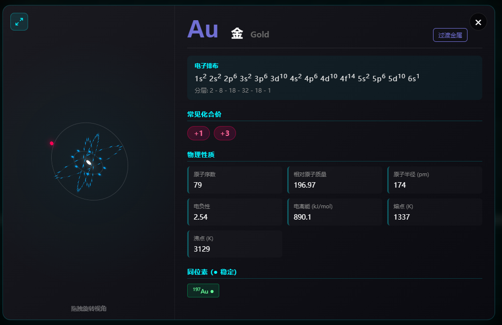
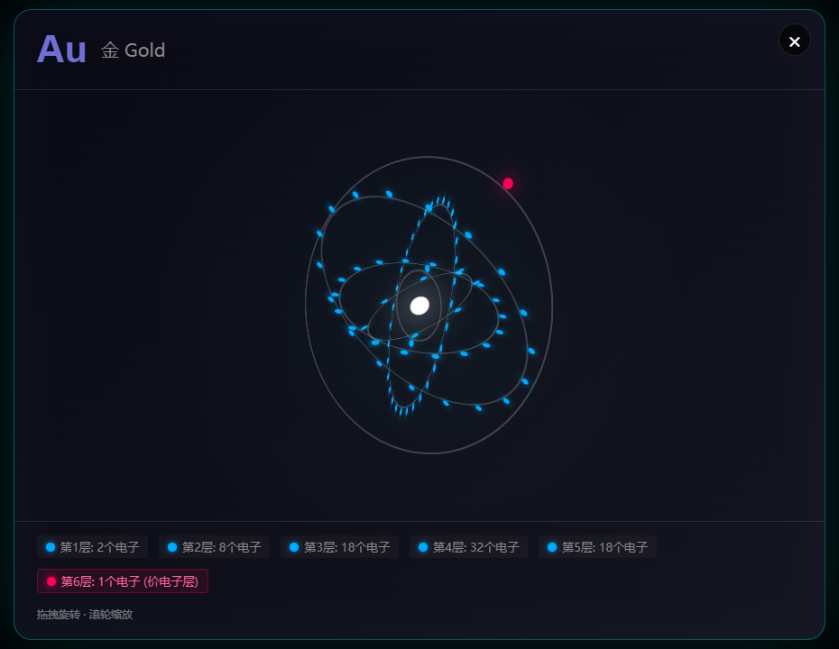

<div align="center">
  <h1>⚛️ Future Style Periodic Table</h1>
  <h3>Interactive Future-Style Periodic Table · Immersive Chemistry Education · Bilingual Support</h3>

  <p>
    118 elements, 5% of the universe, blooming at your fingertips.
  </p>

  <p>
    <a href="https://github.com/ruanyf/weekly/blob/master/docs/issue-383.md">
        
    </a>
    
    
    
    
  </p>

  <h3>
    👉 <a href="https://seanwong17.github.io/Future-Style-Periodic-Table/">Click to Enter: Immersive Experience (Live Demo)</a> 👈
  </h3>

</div>

---

## 📖 Introduction

**Future Style Periodic Table** is an interactive periodic table of chemical elements that runs in modern browsers. Unlike traditional static charts, this project adopts a dark cyberpunk style, combining neon effects, glassmorphism, and smooth interactive animations to redefine the visual presentation of chemical elements.

The project covers all **118 chemical elements**, including detailed data such as atomic numbers, relative atomic masses, electron configurations, isotopes, and oxidation states. It supports multi-dimensional heatmap visualization and 3D atomic structure simulation, making it an excellent practice for learning chemistry and exploring front-end technologies.

> **🌟 Highlights:** Click on any element to enter an immersive detail page, drag to rotate the 3D atomic model, and feel the beauty of electron cloud orbits. Supports Chinese/English bilingual switching to meet global user needs.

---

## ✨ Core Features

### 🎨 Immersive Visual Experience
- **Cyberpunk Aesthetics**: Dark background with dynamic grid particles, creating a tech-filled immersive atmosphere.
- **Neon Category Highlights**: 10 major element categories with unique colors, glowing borders on hover.
- **Fully Responsive**: Elegant layouts from 4K desktops to mobile devices (with landscape prompts).
- **Bilingual Support**: One-click toggle between Chinese/English interface to meet different language users' needs.

### 📊 Multi-dimensional Data Visualization
- **Heatmap Mode**: One-click switching of spectral distributions for atomic radius, electronegativity, ionization energy, melting point, and boiling point.
- **Category Filtering**: Click on legends to highlight specific categories (alkali metals, noble gases, lanthanides/actinides, etc.).
- **Real-time Search**: Support for quick location via element symbols, Chinese/English names, or atomic numbers.

### 🔬 3D Atomic Structure Simulation
- **CSS 3D Orbital Model**: Real-time rendering of electron shells and rotating electrons based on electron configuration algorithms.
- **Gesture Interaction**: Support for mouse drag/touch swipe, 360° rotation to observe atomic structure.
- **🆕 Expanded View**: Click the icon on the atomic model to enter a standalone full-screen view, supporting **scroll-to-zoom** for detailed electron shell observation.
- **Detailed Data Cards**: Display electron configuration formulas, layered electron counts, isotope stability, common oxidation states, etc.

---

## 📸 Screenshots

**Periodic Table Overview**


**Heatmap Mode**


<table>
  <tr>
    <th width="54%">Element Detail Card</th>
    <th width="46%">3D Atomic Model</th>
  </tr>
  <tr>
    <td valign="top"></td>
    <td valign="top"></td>
  </tr>
</table>

---

## 🛠️ Tech Stack

This project is developed with **Vanilla JavaScript (ES6+)**, zero build dependencies, ready to use out of the box.

| Technology | Purpose |
|:---|:---|
| **HTML5** | Semantic structure and DOM containers |
| **CSS3** | Grid/Flexbox layout, 3D Transforms, CSS Variables, Media Queries |
| **JavaScript** | Data-driven rendering, electron configuration algorithms, event interaction, animation control |

### Technical Highlights

- 📐 **CSS Grid**: Precise drawing of irregular periodic table grid layouts.
- 🎭 **CSS 3D Transforms**: `transform-style: preserve-3d` to achieve electron orbital rotation.
- 🎨 **CSS Variables**: Unified theme color management for easy customization.
- 📱 **Responsive Design**: Multi-breakpoint media queries to adapt to various screen sizes.

---

## 📂 Project Structure

The project adopts a flat structure, with all data embedded through JS variables, **no backend environment required**.

```text
Future-Style-Periodic-Table/
├── screenshots/         # Preview screenshots
│   ├── overview.png     # Periodic table overview
│   ├── heatmap.png      # Heatmap mode
│   ├── detail.png       # Element detail card
│   └── atom3d.png       # 3D atomic model
├── data.js              # Data file
├── index.html           # Entry file
├── main.js              # Logic code
├── styles.css           # Stylesheet
├── README.md            # Project description (Chinese)
├── README_en.md         # Project description (English)
└── LICENSE              # MIT open source license
```

---

## 🚀 Quick Start

Thanks to the pure static webpage design, this project has excellent portability:

1. **Download**: Clone or download the project archive.
2. **Run**: Open `index.html` directly in a browser.
3. **Note**: No need to install Node.js, no need to configure a local server, ready to use out of the box.

---

## 🤝 Credits

The inspiration for this project comes from sharing by online creators, and we express our sincere thanks!

- **Original Inspiration**: [Douyin Video Link]
- **Data Reference**: Element data compiled from public chemistry databases

> *If you are the original author and wish to modify the attribution method, please submit an Issue or contact me at any time.*

---

## 📄 License

This project uses the [MIT License](LICENSE) open source license.

- ✅ You can freely use, copy, modify, and distribute this project.
- 📝 Please retain the original author's copyright notice in derivative works.

---

## 📈 Star History

[](https://star-history.com/#SeanWong17/Future-Style-Periodic-Table&Date)

---
<div align="center">
  <sub>Designed with ❤️ by Sean Wong</sub>
</div>
